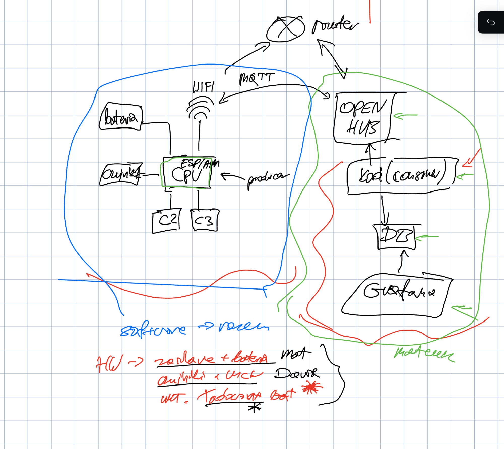

# projekt_eter

## Lista czujników
- CO2 - SCD41
- Pyły - PMS5003
- cisnienie - wibme280

## Podział obowiazków

### Mat
- [ ] grafana
- [ ] db
- [ ] openhub
- [ ] router
- [ ] proejkt uklad zasilania HW
- [ ] software

### Daw
- [ ] prototyp na esp
- [ ] czujniki
- [ ] test wifi
- [ ] mqtt
- [ ] projekt szujniki + mcu w HW
- [ ] software

## Schemat poglądowy
